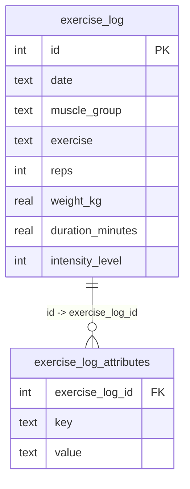
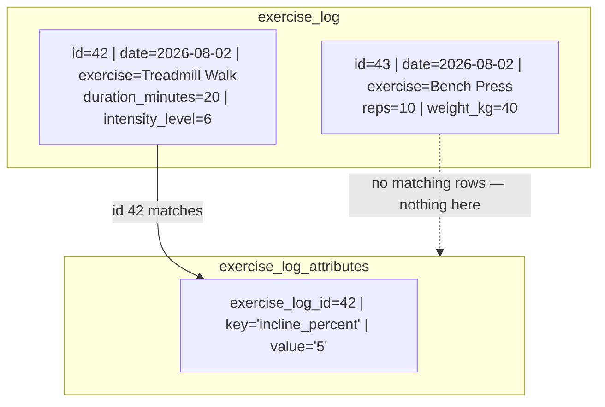

# EAV example — Treadmill set with an extra "incline" attribute

## The two tables



`exercise_log` stays exactly as it is today — no new columns, ever.
`exercise_log_attributes` is a brand new, separate table that only gets a row
when a set actually needs an extra field.

## What it looks like with real data

One Treadmill set (has incline) and one Bench Press set (doesn't):



Notice: `id=43` (Bench Press) has **zero** rows in the attributes table.
That's the whole point of EAV — you never touch `exercise_log` and never add
a mostly-empty column just because *one* exercise needed *one* extra field.

## The cost: reading it back needs a join

Plain column (if incline were just a column on `exercise_log`):

```sql
SELECT incline_percent FROM exercise_log WHERE id = 42;
```

EAV version (what you actually have to write instead):

```sql
SELECT value
FROM exercise_log_attributes
WHERE exercise_log_id = 42 AND key = 'incline_percent';
-- value comes back as the TEXT '5', not a number — cast it if you want to
-- average/sum it: CAST(value AS REAL)
```

And if you wanted "incline alongside the normal set data" in one row, you'd
need a join:

```sql
SELECT el.*, ea.value AS incline_percent
FROM exercise_log el
LEFT JOIN exercise_log_attributes ea
  ON ea.exercise_log_id = el.id AND ea.key = 'incline_percent'
WHERE el.id = 42;
```

## Summary

| | Extra column per new field | EAV side-table | JSON column |
|---|---|---|---|
| Schema changes when a new field shows up | Yes (`ALTER TABLE`) | No | No |
| Query for a known field | Plain `SELECT` | Needs join/subquery | `json_extract()` |
| Types / constraints on the value | Real (INTEGER, REAL...) | Everything is TEXT | Whatever JSON allows, unchecked by SQLite |
| Good fit for | A handful of fields everyone uses | Truly unbounded, user-defined attributes | A few one-off fields on an otherwise fixed table |
